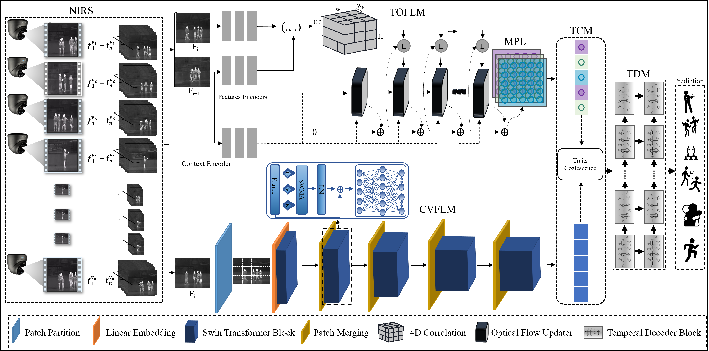

## Contextual-visual-and-motion-salient-fusion-framework-for-action-recognition-in-dark-environments

This paper has been published in [Knowledge-Based Systems](https://www.sciencedirect.com/journal/knowledge-based-systems)

### 1. The Proposed Framework
Infrared (IR) human action recognition (AR) exhibits resilience against shifting illumination conditions, changes in appearance, and shadows. It has valuable applications in numerous areas of future sustainable and smart cities including robotics, intelligent systems, security, and transportation. However, current IR-based recognition approaches predominantly concentrate on spatial or local temporal information and often overlook the potential value of global temporal patterns. This oversight can lead to incomplete representations of body part movements and prevent accurate optimization of a network. Therefore, a contextual-motion coalescence network (CMCNet) is proposed that operates in a streamlined and end-to-end manner for robust action representation in darkness in a near-infrared (NIR) setting. Initially, data are preprocessed to separate foreground, normalized, and resized. The framework employs two parallel modules: the contextual visual features learning module (CVFLM) for local feature extraction, and the temporal optical flow learning module (TOFLM) for acquiring motion dynamics. These modules focus on action-relevant regions used shift window-based operations to ensure accurate interpretation of motion information. The coalescence block harmoniously integrates the contextual and motion features within a unified framework. Finally, the temporal decoder module discriminatively identifies the boundaries of the action sequence. This sequence of steps ensures the synergistic optimization of both CVFLM and TOFLM and thorough competent feature extraction for precise AR. Evaluations of CMCNet are carried out on publicly available datasets, InfAR and NTURGB-D, where superior performance is achieved. Our model yields the highest average precision of 89% and 85% on these datasets, respectively, representing an improvement of 2.25% (on InfAR) compared to conventional methods operating at spatial and optical flow levels which underscores its efficacy.

**The Proposed framework overview:** The complete process of the proposed CMCNet framework composed of various significant steps. Initially, the input streams undergo a pre-processing step, which is followed by a feature extraction module consisting of the temporal optical flow learning module (TOFLM) for capturing the details of the motion, and the contextual visual feature learning module (CVFLM) for extracting contextual information. The temporal coalescence module (TCM) then intelligently amalgamates the appearance and motion information. Finally, the temporal decoder module (TDM) extracts sequential patterns from the coalescent features, enabling optimal fitting for accurate predictions in the prediction module.

### 2. Datasets
The datasets can be downloaded from the following links.

Download NTURGB-D-120 dataset: [Click here](https://rose1.ntu.edu.sg/dataset/actionRecognition/)

Download InfAR dataset: [Click here](https://www.sciencedirect.com/science/article/pii/S0925231216307044)

## 3. Acknowledgments
This work was supported by National Research Foundation of Korea (NRF) grant funded by the Korea government, MSIT, Grant/Award Number:(2023R1A2C1005788).
